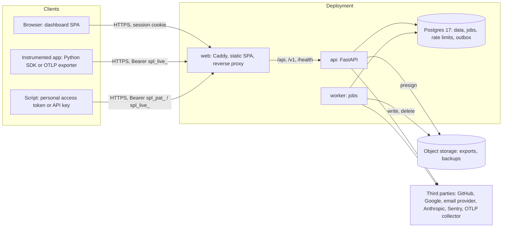

# Spanlight threat model

This document describes what Spanlight protects, where its trust boundaries are, the threats at each boundary (classified with STRIDE), the controls that answer them, and the risks that remain. Every control names the module that implements it, so a reader can check the claim against the code. The companion [OWASP ASVS Level 2 checklist](asvs-l2-checklist.md) gives a status for each verification requirement.

- **Scope:** the server (`backend/`), the dashboard and its web server configuration (`frontend/`, `deploy/Caddyfile`), the Python SDK (`sdks/python/`) and the deployment files in `deploy/`.
- **Method:** a data-flow view of the system, then STRIDE (Spoofing, Tampering, Repudiation, Information disclosure, Denial of service, Elevation of privilege) applied to every boundary a request or a credential crosses.
- **Status:** written against the code as of October 2026, before the first `1.0` release. It is reviewed whenever a change adds a trust boundary, a credential type, an outbound integration or a store of user data.

To report a vulnerability, follow [SECURITY.md](../../SECURITY.md).

## 1. System overview

Spanlight ships as one image with three roles, plus Postgres and optional external services:

- **web** (Caddy, `deploy/Caddyfile`) serves the built SPA and proxies `/api/*`, `/v1/*` and `/health/*` to the api. It sets the security headers and the Content-Security-Policy. TLS is terminated in front of it (a platform edge or the operator's reverse proxy); Caddy itself runs with `auto_https off`.
- **api** (`backend/app/main.py`) serves the dashboard API under `/api/v1`, ingestion under `/v1/traces` and `/v1/otlp/traces`, and health probes.
- **worker** (`backend/app/jobs/worker.py`) runs retention, rollups, exports, email delivery from the outbox, backups and the demo traffic generator.
- **Postgres** is the only datastore. The api and worker connect as a role without `SUPERUSER` or `BYPASSRLS`; migrations run as the database owner.
- **Object storage** (any S3-compatible service) holds trace exports and nightly database dumps. It is optional.

## 2. Assets

| Asset | Where it lives | Why it matters |
|---|---|---|
| Prompts, completions and span attributes | `spans` and `traces` tables; export files; database dumps | Customer data. Can contain personal data, business secrets and anything a user typed into an LLM application. |
| Project API keys (`spl_live_…`) | Only the SHA-256 of the secret, in `api_keys` | Write telemetry into a project; with `traces:read`, read it. |
| Personal access tokens (`spl_pat_…`) | Only the SHA-256 of the secret, in `personal_access_tokens` | Act as a user on `/api/v1` within that user's memberships. |
| Session tokens | Browser cookie; SHA-256 in `sessions` | Full dashboard access as the user. |
| Passwords | argon2id hashes in `users` | Account takeover, and reuse on other sites. |
| Two-factor seeds and recovery codes | Seeds sealed with AES-256-GCM in `users`; recovery codes as SHA-256 | Second factor of every account that enabled it. |
| Email link tokens (verify, reset) and invite tokens | SHA-256 in `email_tokens` and `invites`; the raw link in a queued email until it is delivered | Account recovery and organization membership. |
| `SECRET_KEY` | Environment of api and worker | Signs CSRF tokens, the OAuth state cookie and the two-factor login challenge. |
| `CREDENTIALS_KEYS` | Environment of api and worker | Opens every sealed two-factor seed. |
| Database credentials | Environment (`DATABASE_URL`, `BACKUP_DATABASE_URL`) | `BACKUP_DATABASE_URL` uses a role that bypasses row-level security and can read every tenant. |
| Object storage keys | Environment (`S3_ACCESS_KEY`, `S3_SECRET_KEY`) | Read and delete every export and every database dump. |
| Provider secrets | Environment (OAuth client secrets, email provider key, `ANTHROPIC_API_KEY`) | Impersonating the instance to providers; spending the demo budget. |
| Audit log | `audit_events` | Accountability for membership, key, project and account changes. |
| Availability | api, worker, Postgres | Ingestion must keep up with customers' applications. |

## 3. Actors

- **Anonymous internet user:** can reach the web port: the SPA, signup, login, password reset, the demo sign-in, the OAuth routes and the health probes.
- **Signed-up user:** sign-up is open, so anyone can hold a valid account and create their own organization. This is the main attacker for tenant isolation.
- **Organization member** with role `viewer`, `member`, `admin` or `owner` (`backend/app/core/permissions.py`). A member may try to exceed the role.
- **Holder of a leaked credential:** an API key in an application's configuration, a personal access token in a script, an export download link, an invite link.
- **Instrumented application:** sends arbitrary, possibly hostile, telemetry with a valid API key.
- **Operator:** runs the deployment and holds every secret. Trusted. Mistakes in configuration are in scope for this document, malicious operators are not.
- **Compromised dependency or third party:** a provider, an email service, the CDN that serves the API reference page.

## 4. Trust boundaries and threats

Each table lists the threat, its STRIDE class, the control and the code that implements it.

### TB1. Browser to web and api (dashboard)

The browser holds a session cookie; every state-changing request crosses this boundary.

| Threat | STRIDE | Control | Code |
|---|---|---|---|
| Password guessing and credential stuffing | S | argon2id hashes; at most 5 failed sign-ins per email and 20 per IP in 15 minutes, counted in Postgres so the limit holds across replicas; two-factor failures count against the same limit | `core/security.py` (`hash_password_async`, `verify_password_async`), `auth/login_throttle.py` (`enforce_login_throttle`), `api/v1/auth.py` (`login`), `api/v1/totp.py` (`totp_verify`) |
| Learning which emails have accounts through login or password reset | I | An unknown email still verifies a dummy argon2 hash, so timing is equal; one error message for every failure; forgot-password answers 202 whether or not the address exists, and counts both alike | `core/security.py` (`verify_password_async`), `api/v1/auth.py` (`login`, `forgot_password`) |
| Session theft through script access or cross-site sending | S, I | Session cookie is `HttpOnly`, `SameSite=Lax`, and `Secure` whenever `APP_BASE_URL` is https; 32 random bytes; only its SHA-256 is stored | `api/v1/auth.py` (`set_auth_cookies`), `services/sessions.py`, `core/security.py` (`new_token`, `token_digest`) |
| Session fixation and stale sessions | S | A new token is issued at every sign-in; sessions slide on a 7-day idle timeout with a 30-day absolute limit (1 hour for the demo); logout deletes the row; a password reset (by email or with the admin CLI) ends every session of the user | `services/sessions.py`, `services/credentials.py` (`replace_password`) |
| Cross-site request forgery | T, E | Two layers on every POST, PUT, PATCH and DELETE under `/api`: the `Origin` header must be in the allowlist (a missing `Origin` is refused), and the `X-CSRF-Token` header must equal the `spl_csrf` cookie and carry a valid HMAC bound to the session | `core/middleware.py` (`OriginCheckMiddleware`), `api/deps.py` (`authenticate_session`), `core/security.py` (`new_csrf_token`, `verify_csrf_token`) |
| A bearer request falling back to the cookie, or skipping CSRF checks while acting anonymously | E | A request with `Authorization: Bearer` loses its `Cookie` header before routing and is authenticated by the bearer alone; routes that need no sign-in refuse a bearer instead of ignoring it | `core/middleware.py` (`BearerRequestMiddleware`), `api/deps.py` (`refuse_credentials`, `ANONYMOUS`) |
| Login CSRF and account takeover through OAuth | S | Authorization code flow with PKCE (S256); `state` kept in a signed, 10-minute, `HttpOnly` cookie scoped to the OAuth routes and compared in constant time; a provider identity is matched by its stable subject, never by email; an email match links only when both the provider and the local account have verified the address; a link must finish in the session that started it | `auth/oauth_state.py`, `auth/oauth_client.py`, `auth/oauth_service.py` (`sign_in_with_profile`, `link_identity`), `api/v1/oauth.py` |
| Pre-hijacking: registering a victim's address before they do, then keeping access | S | An unverified local account never gets a provider identity attached by email match; a password reset that proves the inbox drops every identity linked while the address was unproven | `auth/oauth_service.py` (`_resolve`), `auth/password_reset.py` (`complete_password_reset`) |
| Open redirect after sign-in | S | The `next` path must start with exactly one `/`, contain no backslash after it and no control characters; it is checked again when the signed state is read | `auth/oauth_state.py` (`safe_next`, `read_state`) |
| Bypassing the second factor | S, E | A password or provider sign-in for a user with TOTP returns a signed, 5-minute challenge instead of a session; the challenge is bound to a fingerprint of the current password hash, so a password change ends it; codes are accepted once (step tracking) within one step of clock drift; recovery codes are single use; organizations can require two-factor authentication for every member | `auth/login_challenge.py`, `auth/totp.py` (`match_step`), `auth/totp_service.py`, `api/v1/totp.py`, `api/deps.py` (`_member_access`) |
| Reset and verification link abuse | S, I | 32 random bytes, stored as SHA-256, spent by one conditional `UPDATE`, expiring after 1 hour (reset) or 24 hours (verify); the token travels in the URL fragment, which browsers do not send to servers or in `Referer`; a new reset link retires earlier ones; at most 3 reset requests per email and 10 per IP in 15 minutes | `auth/email_tokens.py`, `auth/password_reset.py`, `auth/verification.py` |
| Cross-site scripting | T, E | React escapes all rendered values; no `dangerouslySetInnerHTML` or `eval`; a strict CSP on every response except the API reference page and the documentation site under `/docs/`, which have their own policies (the documentation site's adds only its own inline scripts, by SHA-256 hash; the strict policy is `default-src 'self'`, no `script-src` relaxation, `frame-ancestors 'none'`, `base-uri 'self'`, `form-action 'self'`); `X-Content-Type-Options: nosniff`. `deploy/smoke.sh` asserts the policy in CI | `deploy/Caddyfile`, `deploy/smoke.sh` (`check_content_security_policy`) |
| Clickjacking | T | `X-Frame-Options: DENY` and `frame-ancestors 'none'` | `deploy/Caddyfile` |
| Downgrade to plain HTTP | I | `Strict-Transport-Security` with `includeSubDomains` on every response; startup refuses the development `SECRET_KEY` when `APP_BASE_URL` is https | `deploy/Caddyfile`, `config.py` (`_require_real_secret_over_https`) |
| Ending other people's sessions, or reading their session list | E | Session routes act only on the caller's sessions; the shared demo account cannot end sessions and sees only its own | `api/v1/auth.py` (`list_sessions`, `delete_session`) |
| Exhausting the server with unauthenticated requests | D | Login, signup (10 per IP per hour, counted before the password is hashed), password reset, verification mail and the demo sign-in are throttled. argon2id hashing and verification run on a dedicated two-thread pool with at most two in flight, so they neither block the event loop nor multiply memory use. See R5 for what remains. | `api/v1/auth.py` (`signup`), `auth/login_throttle.py`, `core/throttle.py`, `core/ratelimit.py` (`DEMO_LIMITER`), `core/security.py` (`hash_password_async`, `verify_password_async`: two-thread pool, two at a time) |
| Oversized request bodies on the dashboard API | D | Every `/api/v1` body is limited to 1 MiB: a declared `Content-Length` over the limit is refused unread, and a chunked or understated body is cut off while it is read. Both answer `413 PAYLOAD_TOO_LARGE`. Ingestion keeps its own larger limit (TB2). | `core/body_limit.py` (`BodyLimitMiddleware`), `main.py` |
| Secrets shown once staying in caches | I | New API keys, invite links, new personal access tokens, two-factor setup (secret and `otpauth` URI) and recovery codes are sent with `Cache-Control: no-store` and `Pragma: no-cache` | `core/security.py` (`mark_uncacheable`), `api/v1/keys.py` (`create_key`), `api/v1/orgs.py` (`create_invite`), `api/v1/tokens.py`, `api/v1/totp.py` |

### TB2. Instrumented application to ingestion

An application sends telemetry with a project API key to `POST /v1/traces` or `POST /v1/otlp/traces`. The content of the payload is untrusted.

| Threat | STRIDE | Control | Code |
|---|---|---|---|
| Writing into another tenant's project | S, T | The project comes from the API key, never from the payload; the key needs the `ingest:write` scope; every write runs under row-level security bound to that project | `api/ingest.py` (`authenticate_ingest`, `_store`), `api/deps.py` (`require_key_scope`), `ingest/pipeline.py` |
| Guessing or brute-forcing API keys | S | 32 base32 characters of secret (160 bits) behind a 12-character lookup id; only the SHA-256 is stored and compared in constant time; a wrong secret gets the same 401 whether the key exists, was revoked or expired | `core/security.py` (`generate_key`, `parse_key`, `key_secret_matches`), `api/deps.py` (`_authenticate_api_key`) |
| Leaked key used indefinitely | S | Keys can carry an expiry and can be revoked from the dashboard; last use is recorded at minute resolution | `api/v1/keys.py` (`revoke_key`), `api/deps.py` (`_record_use`), [revoke-key runbook](../runbooks/revoke-key.md) |
| Oversized or compressed-bomb bodies | D | The body is read in a stream and refused above 5 MB; gzip and deflate are decompressed with the same cap on the output; at most 1000 spans per batch; per-key token bucket of 50 requests per second with bursts of 100 | `api/ingest.py` (`read_bounded_body`, `_decompress`, `_check_span_count`), `core/ratelimit.py` (`INGEST_LIMITER`) |
| Deeply nested JSON | D | JSON nested more than 64 levels (or deeper than the parser can follow) is refused with `400 INVALID_JSON` instead of reaching recursive code; the same limit applies to JSON-encoded prompt and completion strings in OTLP attributes, which are kept as plain text when too deep; a pagination cursor that nests too deep is a 422; OTLP protobuf is bounded by the protobuf library's own depth limit and fails as `400 INVALID_OTLP` | `ingest/pipeline.py` (`parse_json_body`), `ingest/otlp.py` (`decode_protobuf`) |
| Malformed values that break storage | T, D | Strict JSON (no `NaN` or `Infinity`), NUL characters stripped, typed schema with length and range limits, timestamps checked against clock skew and the retention horizon; a bad span is rejected alone, not the batch | `ingest/pipeline.py` (`parse_json_body`), `ingest/schemas.py`, `ingest/normalize.py` |
| Secrets sent inside prompts or attributes being stored | I | Every string in input, output and attributes is scanned before storage: Spanlight credentials of every kind, OpenAI- and Anthropic-style keys, bearer tokens, AWS access keys and labelled AWS secrets, and Luhn-valid card numbers are replaced with `[REDACTED]`; payloads are truncated to 32 KB; a project can turn payload capture off | `core/redact.py`, `ingest/normalize.py` (`_prepare_payload`) |
| Stored script in a payload attacking dashboard users | E | Payloads are rendered as text by React, never as HTML, under the strict CSP | `frontend/src/features/traces/`, `deploy/Caddyfile` |
| Replays inflating counts | T | Spans are upserted on their natural key and trace totals are recomputed from stored spans, so a replayed batch changes nothing | `ingest/pipeline.py` |

### TB3. Scripts with personal access tokens or API keys to `/api/v1`

| Threat | STRIDE | Control | Code |
|---|---|---|---|
| A token doing more than its user may | E | A token is its user: memberships are re-read on every request; a `read` token is refused on any permission classed `write` and on any method other than GET, HEAD or OPTIONS | `api/deps.py` (`require`, `_member_access`), `core/permissions.py` (`PERMISSION_CLASSES`) |
| A leaked token turned into a session or more tokens | E | Session-only routes (sign-out, sessions, token management, two-factor settings, provider linking) refuse tokens with `SESSION_REQUIRED` and API keys with `KEY_SCOPE` | `api/deps.py` (`current_session`), `auth/tokens.py` |
| An API key reading another project | E, I | A key may only use routes that opt in with `allow_api_key=True`, which is allowed only for `project:read`; it needs `traces:read`, and the project in the path must be its own (otherwise 404); the RLS binding comes from the key | `api/deps.py` (`_key_access`) |
| Scraping a project through a read credential | D, I | Bearer reads are limited to 20 per second with bursts of 40 per credential | `api/deps.py` (`_limit_bearer_read`), `core/ratelimit.py` (`API_READ_LIMITER`) |
| A retried POST creating duplicates | T | `Idempotency-Key` support on exports: a replay is authorized again and answered with the stored response; keys are scoped to the principal | `core/idempotency.py`, `core/idempotency_store.py` |

### TB4. Application to Postgres: the tenant boundary

All tenants share one database. A bug in any query must not show one tenant's data to another.

| Threat | STRIDE | Control | Code |
|---|---|---|---|
| A query that forgets its project filter | I | Three layers: middleware identifies the principal; `require()` resolves the organization or project from the path and checks membership against the single permission table (non-members get 404); for project routes it binds the transaction with `set_config('app.project_id', …, true)`. Row-level security is `ENABLE`d and `FORCE`d on `traces`, `spans`, both rollup tables and `exports`, so an unbound or wrongly bound transaction sees no rows | `api/deps.py` (`require`), `db/rls.py` (`bind_project`), `alembic/versions/0001_initial_schema.py`, `0011_add_rollups.py`, `0014_add_exports.py`, [ADR 0003](../decisions/0003-row-level-security.md) |
| The application role silently bypassing RLS | E | The app connects as a role created with `NOSUPERUSER NOBYPASSRLS NOCREATEDB NOCREATEROLE`; migrations run as the owner in a separate step whose URL never reaches the app process | `db/roles.py` (`ensure_app_role`), `deploy/compose.yaml`, `deploy/Dockerfile` |
| A binding leaking to the next user of a pooled connection | I | Both settings are transaction-local, so they end with the transaction | `db/rls.py` |
| Cross-project worker jobs | I | Only retention, rollups and export expiry set the bypass flag, each for its own transaction; the export job reads under the requesting project's binding | `db/rls.py` (`bypass_rls`), `jobs/tasks/retention.py`, `rollups/jobs.py`, `exports/expiry.py`, `exports/jobs.py` |
| SQL injection | T, I, E | SQLAlchemy expressions and bound parameters everywhere, including the hand-written statements; DDL in the role provisioning uses `psycopg.sql` quoting | `core/ratelimit.py`, `jobs/tasks/retention.py`, `db/roles.py` |
| Concurrent requests breaking an invariant | T | Row locks and conditional updates on the sensitive paths: sign-in against password reset, single-use tokens, invite acceptance, TOTP verification, provider unlinking, throttles (advisory lock per key), and deletion (fixed lock order) | `services/credentials.py`, `auth/email_tokens.py` (`consume_token`), `api/v1/orgs.py` (`accept_invite`), `core/throttle.py`, `services/deletion.py` |
| Losing track of who changed what | R | Membership, invite, project, key, organization settings and account security changes write an audit event with actor and IP in the same transaction; admins can read and export it as CSV | `services/audit.py`, `api/v1/orgs.py` (`list_audit_events`, `export_audit_csv`) |

### TB5. Application to object storage (exports and backups)

| Threat | STRIDE | Control | Code |
|---|---|---|---|
| Export of another tenant's traces | I | Creating an export needs `export:create` on the project; the job reads under that project's RLS binding | `api/v1/exports.py`, `exports/jobs.py` |
| A download link that lives too long | I | Download URLs are presigned for one hour and only for `done` exports; files are deleted 7 days after completion, and the row is marked `expired` only once the object is gone | `exports/service.py` (`export_out`, `EXPORT_RETENTION`), `exports/expiry.py` |
| CSV formula injection when an export is opened in a spreadsheet | T | Every CSV cell that starts with `=`, `+`, `-`, `@`, tab or carriage return is prefixed with `'`; the audit log CSV uses the same writer | `exports/writers.py` (`safe_csv_cell`, `csv_line`), `exports/audit.py` |
| Database dump disclosure | I | Dumps are written to a private bucket; the dump credentials reach `pg_dump` only as libpq environment variables, never on a command line or in a log line, and the child process inherits nothing else from the environment | `backups/service.py`, `backups/jobs.py`, [restore runbook](../runbooks/restore.md) |
| Unbounded backup growth | D | 14 daily and 8 weekly dumps are kept; anything else under `backups/` that the job created is pruned | `backups/retention.py` |

### TB6. Application to third parties

| Threat | STRIDE | Control | Code |
|---|---|---|---|
| Server-side request forgery | I, E | No route fetches a URL a user supplies. Outbound calls go to fixed provider endpoints (GitHub, Google), to the operator's email provider, object store and OTLP collector, and to Anthropic for the demo | `auth/oauth_client.py`, `auth/oauth_providers.py`, `email/providers/`, `storage/s3.py`, `core/tracing.py` |
| Provider tokens leaking | I | The provider access token is used inside `fetch_profile` and dropped; provider error text is reduced to a short code before logging; redirects are not followed | `auth/oauth_client.py` |
| Mail header injection | T | Messages are built with `email.message.EmailMessage`, which refuses line breaks in headers; HTML bodies escape every value; SMTP uses STARTTLS with certificate verification unless the operator turns it off | `email/providers/smtp.py`, `email/templates.py` |
| Open mail relay through invitations | D | Mailed invites are limited to 20 per organization per hour; verification mail to 3 per user per hour | `services/invites.py`, `api/v1/auth.py` (`request_email_verification`) |
| Customer data reaching the error tracker | I | Sentry never receives request bodies or local variables; the query string, URL fragment and `Referer` header are removed from every event; default PII is off | `core/sentry.py` (`init_sentry`, `before_send`) |
| Customer data reaching the tracing backend | I | Self-tracing records route templates, never bodies or headers; SQL spans carry the statement text with placeholders and never parameter values; request spans carry the request id and the kind of credential, never an id, email or secret; ingestion, health and metrics are never traced, so an instance can trace into itself without a feedback loop | `core/tracing.py` (`EXCLUDED_URLS`, `TraceAttributesMiddleware`) |
| Email bodies with live links kept in the database | I | The outbox payload is reduced to its subject once the delivery settles | `notifications/jobs.py` (`reduced_payload`) |
| Demo spending running away | D | The demo generator makes real provider calls only with `ANTHROPIC_API_KEY` set, one attempt per job, with a month-to-date budget check before each call | `jobs/tasks/demo_traffic.py` |

### TB7. Operator, deployment and operational endpoints

| Threat | STRIDE | Control | Code |
|---|---|---|---|
| Secrets in logs or errors | I | Settings errors never echo input (`hide_input_in_errors`, keyring errors name the entry, not the value); access logs record the path without the query string; tokens and keys are logged by id, never by value | `config.py`, `core/crypto.py` (`parse_keyring`), `core/middleware.py` (`RequestContextMiddleware`), `api/v1/tokens.py` |
| Stolen database revealing second factors | I | TOTP seeds are sealed with AES-256-GCM under a keyring in `CREDENTIALS_KEYS` that never enters the database; the key id is bound as associated data; rotation keeps old keys readable until nothing is sealed under them | `core/crypto.py`, `auth/totp_service.py`, [ADR 0009](../decisions/0009-application-master-key-encryption.md), [rotate-secrets runbook](../runbooks/rotate-secrets.md) |
| Metrics disclosure | I | `/metrics` is not proxied by Caddy; it answers 404 unless `METRICS_TOKEN` is set and then needs that bearer token, compared as bytes in constant time (a non-ASCII header is a 401, not an error) | `api/health.py` (`metrics`), `deploy/Caddyfile` |
| Readiness probe disclosure | I | `/health/ready` is public by design (uptime monitors use it). It returns status words and two numbers: the worker heartbeat age and the outbox backlog, capped at 10 000. No hostnames, versions or error text | `api/health.py` (`ready`) |
| Spoofed client addresses defeating per-IP limits | S | Caddy trusts no client-IP header unless `TRUSTED_PROXIES` names the proxy in front of it, and overwrites `X-Forwarded-For` with the address it decided on; the api is not published outside the private network | `deploy/Caddyfile`, `deploy/compose.yaml` |
| Version and server fingerprinting | I | The `Server` header is removed; Caddy's admin API is off | `deploy/Caddyfile` |
| Running as root inside the container | E | The backend image runs as an unprivileged `app` user and ships without `pip`; the web image runs Caddy as an unprivileged user (uid 10001) on port 8080 with no file capabilities | `deploy/Dockerfile` |
| Tampered or vulnerable release images | T | Release images are scanned with Trivy (fail on fixable HIGH and CRITICAL), signed with cosign keyless signing, and published with signed CycloneDX SBOMs; CodeQL and Dependabot run on the repository | `.github/workflows/release.yml`, `.github/workflows/codeql.yml`, `.github/dependabot.yml` |

## 5. Residual risks

These are known and accepted for now, or waiting for a fix. Each names what an operator can do about it.

| # | Risk | Why it remains | What reduces it |
|---|---|---|---|
| R1 | **Invite tokens travel in the URL path** (`/invite/<token>`) and in the query of `GET /api/v1/invites/preview?token=…`. They can end up in browser history, in the logs of proxies in front of Spanlight, and in the `Referer` of requests the invite page makes. An invite is accepted by any signed-in holder of the link, whatever address it was mailed to. | Invites are meant to be shareable by hand. The token is 32 random bytes, stored only as SHA-256, single use and valid for 7 days. Spanlight's own access log omits query strings, Sentry events drop `Referer` and the query, and `Referrer-Policy: strict-origin-when-cross-origin` keeps the path from other sites. | Revoke unused invites; do not log full URLs in proxies in front of Spanlight. Moving the token into the URL fragment, as reset and verification links already do, would remove most of this risk. |
| R2 | **Database dumps contain every prompt and completion, and are protected by the bucket only.** Dumps are not encrypted by Spanlight. The api and worker hold the same object storage keys for exports and backups, so either process, if compromised, can read or delete every dump. `BACKUP_DATABASE_URL` must use a role that bypasses row-level security; the Compose file and the Railway template give it to the worker only. | Client-side encryption of dumps and separate backup credentials are not built yet. | Use a private bucket with provider-side encryption and versioning or object lock; give the storage keys the narrowest policy the service allows; keep `BACKUP_DATABASE_URL` out of the api's environment (the Compose file and the Railway template already do); see the [restore runbook](../runbooks/restore.md). |
| R3 | **Account enumeration through signup.** `POST /api/v1/auth/signup` answers `409 EMAIL_TAKEN` for a registered address. Login and password reset do not reveal it. | A signup form that hides existing accounts needs an email round trip before the account exists, which instances without email cannot do. | Signup is limited to 10 attempts per IP per hour, which slows bulk enumeration but does not stop it. |
| R4 | **Organization deletion is synchronous.** Deleting an organization removes its projects, traces and spans in one transaction during the request. A very large organization holds locks for a long time and can time out. | Acceptable at the sizes self-hosted instances run today; a very large organization needs a background deletion job, which does not exist yet. Only an owner can delete, by typing the slug. | Lower project retention before deleting a very large organization. |
| R5 | **Unauthenticated work is bounded, not free.** Password hashing (argon2id, 64 MiB, about 30 ms) runs on a dedicated pool of two threads, and at most two hashes run at once however many requests ask, so hashing uses about 128 MiB at most and never blocks the event loop; further sign-ins and signups wait in line (each waiting request is a cheap coroutine, so a sustained flood shows up as slow logins, not as memory growth). Signup is limited to 10 per IP per hour, login per email and per IP (5 and 20 per 15 minutes), and `/api/v1` bodies to 1 MiB. Many source addresses can still queue hashes faster than two threads drain them (about 70 per second), which slows legitimate sign-ins while the flood lasts. | A small fixed bound protects the api's memory and the rest of its traffic, which matters more than login latency during an attack. The per-IP limits only slow a single source; they are only as good as the client address the proxy reports (R13). | Put a request rate limit for `/api/*` on the reverse proxy in front of Spanlight. |
| R6 | **Rate limits fail open.** When the rate-limit pool cannot provide a connection within a quarter of a second, or the database is unreachable, the request is let through, `spanlight_rate_limit_unavailable_total` is incremented and a warning is logged. A burst of concurrent requests can exhaust the 5-connection pool and so skip limits while it lasts. | A limiter outage must not become an ingestion outage ([ADR 0007](../decisions/0007-postgres-backed-rate-limiting.md)). | Alert on `spanlight_rate_limit_unavailable_total` (or the `rate_limit_unavailable` log line); size `RATE_LIMIT_POOL_SIZE` for your concurrency. |
| R7 | **Row-level security guards against missing filters, not against SQL injection.** The bypass flag is a session setting the application role can set, so code that could run arbitrary SQL as that role could read every tenant. Tables other than the telemetry, rollup and export tables (memberships, keys, invites, audit events) are isolated by the application's checks only. | Postgres cannot restrict who sets a custom setting. All SQL is parameterized. | Keep the application role exactly as provisioned; do not grant it more. |
| R8 | **Telemetry is stored in clear text.** Prompts and completions are readable by anyone with database or dump access. Redaction is pattern-based and catches known credential shapes and card numbers, not arbitrary personal data. | Application-level encryption of telemetry would remove search and aggregation. | Encrypt the database volume; turn off payload capture for projects that must not store content; set short retention. |
| R9 | **Long-lived sessions.** Sessions last up to 7 days idle and 30 days in total, longer than the ASVS Level 2 guidance of 12 hours or 30 minutes idle. | A product decision for a developer tool. Users can end other sessions, and a password reset ends all of them. | None in configuration yet. |
| R10 | **Second factor gaps.** No WebAuthn; recovery codes are 50 random bits stored as unsalted SHA-256 (single use, and online guesses are throttled); users are not notified by email when a password, a second factor or a token changes. Creating API keys and tokens and turning two-factor authentication on do not ask for the password again. | Not built yet. | Organizations can require two-factor authentication for every member. |
| R11 | **The API reference page has a relaxed policy.** `/api/docs` allows inline scripts and loads Swagger UI from jsDelivr without Subresource Integrity, so it trusts that CDN. The page is public, needs no sign-in to load and is on the same origin as the dashboard. | FastAPI's Swagger page is built that way. The relaxed policy is limited to that one path, which `deploy/smoke.sh` asserts. | Block `/api/docs` at the proxy if you do not need it. |
| R12 | **`style-src 'unsafe-inline'` in the strict policy.** The dashboard's components and charts set inline `style` attributes, which need it. Scripts are not affected: the strict policy has no `script-src` relaxation. | Removing it needs the components to stop using inline styles. | None. |
| R13 | **Client addresses depend on the proxy chain.** The api accepts `X-Forwarded-For` from any peer (`--forwarded-allow-ips='*'`) and relies on only Caddy being able to reach it. If the api port is exposed directly, per-IP login and demo limits can be bypassed with a forged header. | Simplifies deployment behind platforms whose proxy addresses change. | Never publish the api port; set `TRUSTED_PROXIES` to the proxy in front of Caddy only. |
| R14 | **Traffic inside the deployment is not encrypted by default.** Caddy to api and api to Postgres use plain connections on the private network, and TLS for clients is terminated in front of Caddy. | The deployment targets a single private network. | Use `sslmode=verify-full` in the database URLs on networks you do not control; terminate TLS on a proxy you trust. |
| R15 | **Deleted data persists in backups** for up to 8 weeks (14 daily and 8 weekly dumps), and an email link stays in the outbox until its delivery settles. | Backups exist to bring data back. | Account for backup retention in your data deletion policy. |
| R16 | **No breached-password check and a 10-character minimum.** Below the ASVS Level 2 requirement of 12 characters. There is no in-app password change for a signed-in user; changing a password goes through the emailed reset or the admin CLI. | Not built yet. | Use a password manager; enable two-factor authentication. |

## 6. Assumptions

- The operator keeps `SECRET_KEY`, `CREDENTIALS_KEYS`, the database passwords and the storage keys secret, and sets `APP_BASE_URL` to the https address users reach.
- TLS is terminated by a trusted proxy or platform edge in front of Caddy, and only that proxy can reach Caddy's trusted client-IP header.
- The api and Postgres are reachable only on a private network.
- The object storage bucket is private.
- Providers (GitHub, Google, the email provider, Anthropic, Sentry) behave as documented. A compromise of one of them is out of scope, but Spanlight sends them no more data than listed above.
